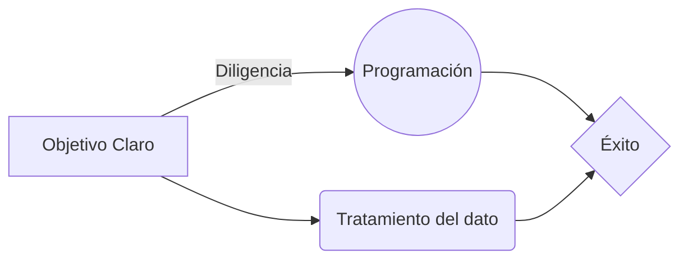

# edem2021MDA
# Máster en Data Analytics por Pablo Sánchez

Hola, mi nombre es **Pablo Sánchez**, bienvenido a **mi página de GitHub**, en ella se mostrarán todas y cada una de las **líneas de código**, **proyectos** e **inquietudes** satisfechas e irresolutas.

El objetivo es eso, mostrar de forma **ordenada** y **visible**, tanto para mí como para el resto, lo que soy **capaz**, o he sido, de hacer en **multitud de lenguajes** de programación.

¡Bienvenido! A partir de aquí, es desde donde **¡empieza el viaje!**

# Lenguajes de Programación

A continuación, se mostrará una **lista** de los **lenguajes y tecnologías empleadas** a lo largo del máster:

-
-
-
-

**Síntesis** de los objetivos:

